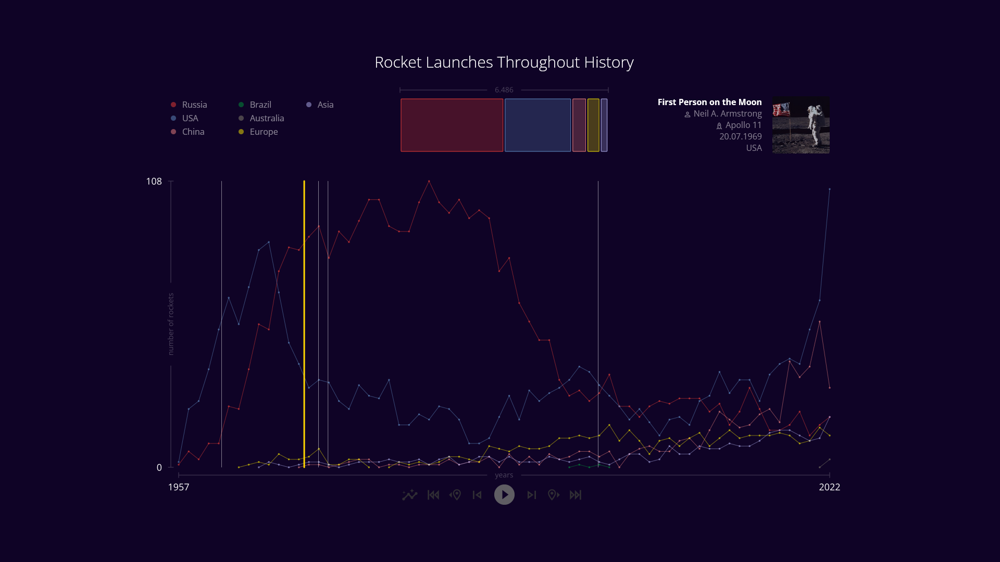

# Space launches throughout history

Final Project for the workshop "Grundlagen im medialen Raum"

> [Project Folder](project/)

> Click image to see demo

 

Professor: [Prof. Dr. Franklin Hernández-Castro](mailto:franklin.castro@hfg.design?subject=[GitHub]%20Project%20HfG%20Rocket%20launches%20throughout%20history)

Students:

- [Send E-Mail](mailto:carina.senger@hfg.design?subject=[GitHub]%20Project%20HfG%20Rocket%20launches%20throughout%20history)/ [Github User](https://github.com/Zajka420): Carina Senger 
- [Send E-Mail](mailto:tim.niedermeier@hfg.design?subject=[GitHub]%20Project%20HfG%20Rocket%20launches%20throughout%20history)/ [Github User](https://github.com/timvonasen): Tim Niedermeier
- [Send E-Mail](mailto:anton.pelezki@hfg.design?subject=[GitHub]%20Project%20HfG%20Rocket%20launches%20throughout%20history)/ [Github User](https://github.com/Bikochii): Anton Pelezki
- [Send E-Mail](mailto:luca.ziegler@hfg.design?subject=[GitHub]%20Project%20HfG%20Rocket%20launches%20throughout%20history)/ [Github User](https://github.com/flixlix): Luca Mário Ziegler Félix

 
HfG - Hochschule für Gestaltung

[Website](https://www.hfg-gmuend.de/en/)

Schwäbisch Gmünd, Germany

WS 22/23

## The task

Our task was to create a paradigm using the [P5JS Library](https://p5js.org/).
The data must come in form of either a .json or a .csv file.
From that data a user of the paradigm ust be able to extract some information or learn something about the data displayed.

The following parameters were given as a requirement:

- coherent design
- low cognitive burden
- interaction
- information from the data (aha effect)

## Our solution

We chose the theme: Rocket launches throughout history.

[Source of the data](https://thespacedevs.com/llapi)

We downloaded a .csv file containing the number of flights per country per day since 1957 until 2023 (we only used the data until OCT'22, because the rest are mere predictions).

From the same source, we also downloaded a .csv file containing all space flights, ordered by day of departure. From this file, we extracted 5 notable flights to also display this information.

## Features

### Countries legends

In the top left corner, we implemented a legend that also serves as a country / region selector. Clicking on a country will highlight its graph. It is possible to select multiple countries at the same time.

### xaxis extremas label

On the x- as well as on the y-axis, we implemented a label indicating the minimum and maximum value of the range.

### Notable launches markers

After deciding on five notable launches throughout history, we put markers on the exact time they took place meaning e.g.: a launch that took place on the 27th of December of 1957 will be much closer to the point displaying 1958 than the point displaying 1957.
By clicking on these markers, the user can find out more details about the launch (exact date, country of operation, description and crew).

### Action Buttons Row

#### Auto Scale Button

The first button allows the user to select wether or not the y axis is dynamic.
This means, e.g.:

- The user selects the country "Brazil"
- If the Auto Scale feature is enabled:
  - The maximum value of the selected country will be displayed on the top of the graph
- If the Auto Scale feature is disabled:
  - The maximum value of the selected country will be displayed on the same height as before selction

#### Skip to Previous / Next Year

 

Using the skip previous / next buttons, the user can manually adjust the time scope that is displayed.

#### Skip to First / Last Year

 

Using the skip to First / to Last buttons, the user can manually adjust the time scope that is displayed.

#### Play / Pause

 

Using the play / pause buttons, the user can toggle the animation, in which the years are exponentially incremented.

The play / pause buttons behaviour is the same as can be viewed on any youtube video:

- The play button is displayed if the animation is off.
- The pause button is displayed if the animation is on.

## Keyboard shortcuts

SPACEBAR: start/stop animation

LEFTARROW: skip to previous year

RIGHTARROW: skip to next year

PgUp: skip to first year

PgDn: skip to last year

m: select next marker

n: select previous marker
